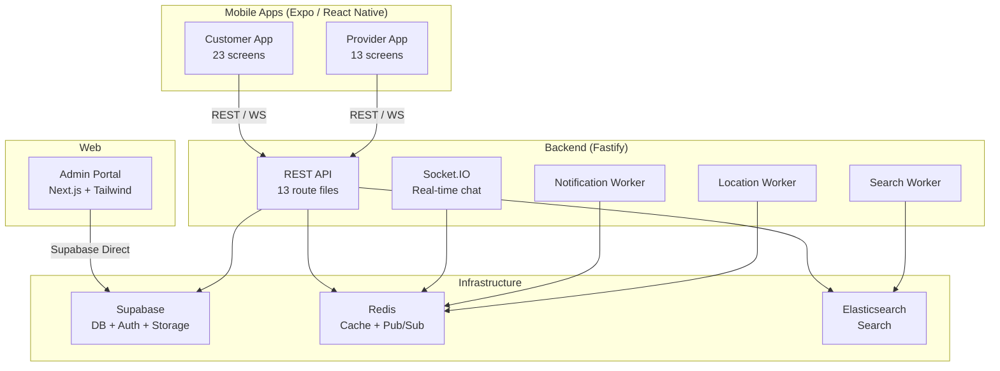

# 🔍 Workla Project — Full Scan Analysis & Next Steps

## Architecture Overview



---

## Module Breakdown

| Module | Tech Stack | Screens/Routes | Size |
|---|---|---|---|
| **Backend** | Fastify + TypeScript, Redis, Elasticsearch, Supabase, Socket.IO | 13 REST route files, 3 workers, WebSocket chat | ~80KB source |
| **Customer App** | Expo 54, React Native 0.81, Zustand, Socket.IO Client | 23 screens (Home, Explore, Search, Bookings, Profile, Chat, Track, Wallet, Referral, Workla Gold, etc.) | ~250KB source |
| **Provider App** | Expo 54, React Native 0.81, Socket.IO Client, Chart-Kit | 13 screens (Home, Jobs, Earnings, Insights, Onboarding, Services, Chat, etc.) | ~150KB source |
| **Admin Portal** | Next.js 16, Tailwind v4, Recharts, Supabase SSR | Dashboard, Bookings, Catalog, Providers, Users, Promotions, Banners, Revenue, Settings | ~30KB source |

---

## Current State — What's Good ✅

1. **Solid tech choices** — Fastify (fastest Node.js framework), Supabase (auth+DB+storage in one), Expo (cross-platform mobile), Next.js (SSR admin).
2. **Docker-ready backend** — Full docker-compose with Nginx gateway, Redis, Elasticsearch, health checks, and resource limits.
3. **Real-time features** — Socket.IO for chat with Redis adapter (scalable across multiple server instances).
4. **Background workers** — Notification, search indexing, and location workers handle async processing.
5. **Rich feature set** — Bookings, payments, wallet, referrals, coupons, ratings/reviews, address management, provider onboarding, chat, live tracking, Workla Gold subscription.
6. **API documentation** — Swagger/OpenAPI auto-generated at `/docs`.
7. **Rate limiting & security** — Helmet + per-IP rate limiting built in.

---

## Critical Issues Found 🚨

### 1. 🗂️ 40+ Orphan SQL Files in Project Root
Over 40 SQL migration/fix/schema files are dumped directly in the **project root**:

```
supabase_schema.sql, supabase_phase1_expansion.sql, ..., supabase_phase19_tier3.sql
fix_rls.sql, fix_beast_mode.sql, fix_dispatch_job.sql, ...
batch10_image_columns.sql, batch11_service_refactor.sql, ...
```

> [!CAUTION]
> These are **untracked database migrations**. There's no migration tool, no version ordering, no rollback capability. One wrong execution could corrupt production data.

### 2. 📦 Legacy Dead Code in Root
Root-level folders `app/`, `screens/`, `components/`, `navigation/` contain abandoned code from an earlier version (only ~5 tiny files). These are confusing and serve no purpose.

### 3. 🔧 Duplicated Code Across Apps
[customer-app/lib/api.ts](file:///c:/Users/vikas/Desktop/WorkLogisticsandAllocation-0f10915cebc590ef1465bf49f1f83478b88a77aa/customer-app/lib/api.ts) and [provider-app/lib/api.ts](file:///c:/Users/vikas/Desktop/WorkLogisticsandAllocation-0f10915cebc590ef1465bf49f1f83478b88a77aa/provider-app/lib/api.ts) are **nearly identical** (~76 lines each). Same pattern for socket clients. No shared package exists.

### 4. 🔒 CORS is Wide Open
```typescript
await server.register(cors, { origin: '*' });  // ← allows ANY domain
```
This is a security risk in production.

### 5. 🧪 Zero Tests
No test files, no test scripts, no test framework installed anywhere in the project. No unit tests, no integration tests, no end-to-end tests.

### 6. 📄 No CI/CD Pipeline
No GitHub Actions, no deployment scripts, no automated linting on push. Everything is manual.

### 7. 🏗️ Monolithic Screen Files
Some screens are extremely large single files:
- `customer-app/(tabs)/index.tsx` — **44KB** (Home screen)
- `customer-app/(tabs)/bookings.tsx` — **24KB**
- `provider-app/(tabs)/index.tsx` — **27KB**
- `provider-app/(tabs)/jobs.tsx` — **22KB**

These are unmaintainable and will only grow worse.

### 8. 🌐 Admin Portal Talks Directly to Supabase
The admin portal bypasses the backend entirely and talks directly to Supabase. This means:
- No audit logging of admin actions
- Business logic can diverge between admin and API
- No rate limiting or authorization checks beyond Supabase RLS

---

## Recommended Next Steps — Priority Ordered

### 🥇 Phase 1: Cleanup & Foundation (1-2 days)

| # | Task | Impact |
|---|---|---|
| 1 | **Move all SQL files into `database/migrations/` folder** with numbered ordering (e.g., `001_schema.sql`, `002_expansion.sql`) | Organization |
| 2 | **Delete legacy root folders** (`app/`, `screens/`, `components/`, `navigation/`) | Removes confusion |
| 3 | **Create a shared package** (`packages/shared/`) for API client, types, constants used by both mobile apps | DRY code |
| 4 | **Lock down CORS** — whitelist only your actual domains (`saarathii.in`, `localhost`) | Security |
| 5 | **Add `.env.example` files** to each module so new devs can set up quickly | Developer experience |

### 🥈 Phase 2: Code Quality & Testing (3-5 days)

| # | Task | Impact |
|---|---|---|
| 6 | **Break down monolithic screens** — extract components from 20KB+ files (e.g., `HomeHeroSection`, `ServiceGrid`, `BookingCard`) | Maintainability |
| 7 | **Add basic backend tests** — use Vitest + Supertest for critical API routes (bookings, auth, payments) | Reliability |
| 8 | **Set up ESLint + Prettier** uniformly across all 4 modules | Code consistency |
| 9 | **Add TypeScript strict mode** — currently loose typing with `any` everywhere | Type safety |
| 10 | **Route admin portal through backend API** — stop direct Supabase access for mutations | Data integrity |

### 🥉 Phase 3: Scale & Ship (1-2 weeks)

| # | Task | Impact |
|---|---|---|
| 11 | **Add CI/CD** — GitHub Actions for lint → test → build → deploy to Render | Automation |
| 12 | **Add push notifications integration** — backend worker exists but needs FCM/APNS setup | User engagement |
| 13 | **Add image upload optimization** — compress & resize images before Supabase Storage | Performance |
| 14 | **Add offline-first capability** — queue bookings/actions when network drops | Reliability |
| 15 | **Add analytics dashboard** — Provider insights tab already exists, needs real data | Business value |

### 🚀 Phase 4: Production Readiness

| # | Task | Impact |
|---|---|---|
| 16 | **Add error monitoring** — Sentry for crash/error tracking | Reliability |
| 17 | **Add logging infrastructure** — structured logs to a log aggregator | Debugging |
| 18 | **Add payment gateway integration** — Razorpay/Stripe for real payments | Revenue |
| 19 | **Add proper database migrations** — use Supabase CLI or similar tool | Safety |
| 20 | **Performance audit** — lazy loading, code splitting, image optimization | Speed |

---

## Quick Stats

| Metric | Count |
|---|---|
| Total source files (non-node_modules) | ~120+ |
| Backend API routes | 13 |
| Customer app screens | 23 |
| Provider app screens | 13 |
| Admin portal pages | ~10 |
| SQL migration files (root) | 40+ |
| Test files | **0** |
| CI/CD pipelines | **0** |
| Shared packages | **0** |

---

## My Recommendation

> [!IMPORTANT]
> **Start with Phase 1** — it takes 1-2 days and immediately makes the codebase cleaner and more professional. The biggest wins are **organizing SQL files**, **deleting legacy code**, and **creating a shared package**.
>
> After that, **Phase 2 Item #6 (breaking down monolithic screens)** will have the biggest impact on your development velocity — it'll make future features 3-4x faster to build.

Let me know which items you'd like to tackle first and I'll create a detailed implementation plan!
